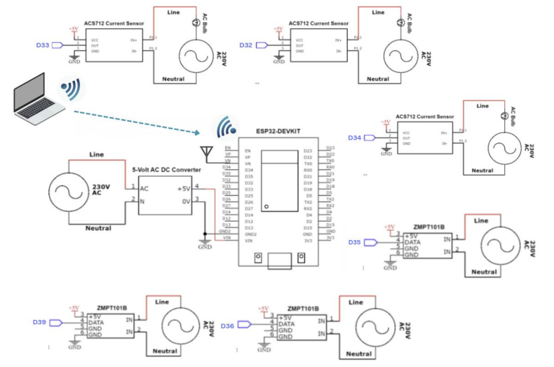

⚡ Smart-Energy-Monitoring-System-with-AI-architecture
🏛️ Project Overview & Institutional Context
This project was developed as a Bachelor Graduation Project (2026) at the Faculty of Engineering, Electronics and Communications Engineering Department, Alamein International University (AIU).

Supervisors: Assoc. Prof. Mohamed Abdelkarim & Eng. Mohamed Tarek.

Team Members: Abdallah Ahmed Riyad, Mohamed Mahmoud Adawi, Ahmed Mohamed Farouk, Tasneem Ahmed Abdelaziz, and Samar Yasser Helmy.

The system bridges the gap between low-cost IoT edge sensing and advanced Artificial Intelligence, transforming a traditional power metering setup into a proactive Prescriptive Analytics Platform.
🛠️ System Architecture & End-to-End Workflow
[ AC Mains / Loads ] ---> [ Sensors (ZMPT1018 & ACS712) ] ---> [ ESP32 Microcontroller ]
                                                                       │ (Serial / UART)
                                                                       ▼
[ Prescriptive AI Engine ] <--- [ C# Desktop Dashboard (.NET) ] <──────┘
         │
         ├── 1. Multi-Output RF Regressor (30-Min Forecasting)
         ├── 2. Isolation Forest (Unsupervised Fault Detection)
         ├── 3. Logistic Regression (Overload Capacity Classifier)
         └── 4. Random Forest Classifier (Device Load-State Recognition)
         📁 Repository Structure & Directory Details
         Smart-Energy-Monitoring-System-with-AI-architecture/
├── 0_Dataset_and_EDA/
│   └── final_augmented_dataset.csv     # Cleaned and augmented energy dataset (UK-DALE derived)
├── 1_Arduino_Node/
│   └── 1_Arduino_Node.ino              # ESP32 firmware for multi-channel ADC sampling & power computation
├── 2_C# Desktop Application/
│   ├── AI_Power_Agent.sln              # Visual Studio Solution file
│   └── AI_Power_Agent/                 # Windows Forms GUI source code, serial handlers, CSV exporter
├── 3_AI_Server/
│   ├── api.py                          # FastAPI backend and inference endpoints
│   ├── dash.py                         # Prescriptive AI & Diagnostics Dashboard (CustomTkinter)
│   ├── Dockerfile                      # Containerization instructions for AI server
│   ├── requirements.txt                # Python dependencies
│   └── *.pkl                           # Serialized ML models (Random Forest, Isolation Forest, etc.)
├── .github/
│   └── workflows/
🔌 Chapter 1: Hardware Implementation & Circuit Design
The hardware layer is built around the ESP32 Microcontroller, leveraging its dual-core processing power and high-resolution ADC channels to execute multi-point independent measurements.Voltage Sensing:
Uses ZMPT1018 voltage transformer modules to step down and safely isolate 220–240V AC mains into micro-controller-safe analog signals.Current Sensing:
Uses non-invasive ACS712 current sensor modules providing linear analog outputs proportional to AC load currents with strong electrical isolation.
Multi-Point Structure: Simultaneously handles 3 distinct monitoring channels ($P_1, P_2, P_3$) with dedicated ADC pins (D32, D33, D34, D35, D36, D39).
### 1. Circuit Diagram 

### 2. Hardware Prototype 

│       └── ci-cd.yml                   # Automated GitHub Actions build and test pipeline
├── docker-compose.yml                  # Multi-container orchestration setup
└── README.md                           # Comprehensive project documentation
